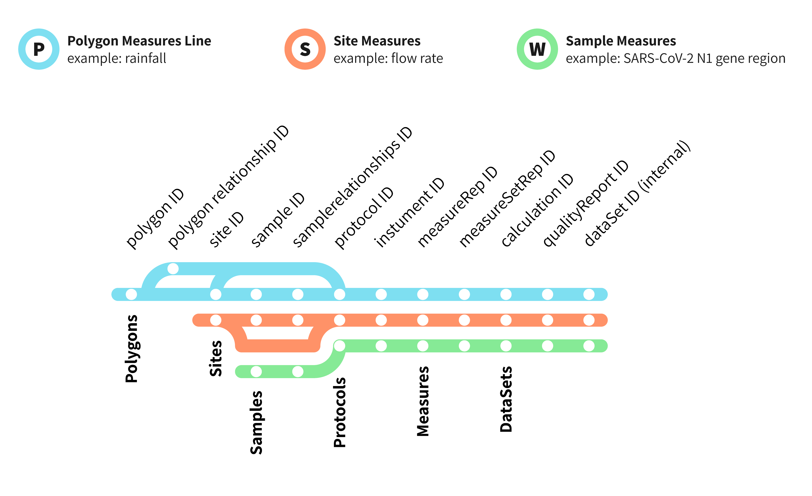
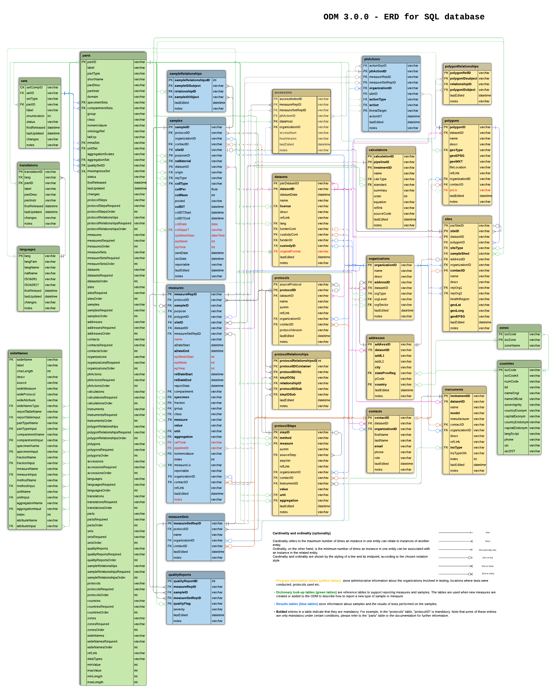

#  The Public Health Environmental Surveillance Open Data Model (PHES-ODM, or ODM)

<!-- badges: start -->

<!-- badges: end -->

## Description

PHES-ODM began as an open data model for wastewater-based surveillance of
SARS-CoV-2. PHES-ODM Versions 2 & 3 expand the original ODM to include
surface and air testing, in addition to water. These later versions
allow for tracking of public health threats in any environment, and
include robust support for reporting biologics, toxins, and/or other
health risks.

The ODM strives to improve environmental and wastewater surveillance
through interoperable data. The ODM follows an open science approach,
including including [FAIR Guiding
Principles](https://www.go-fair.org/fair-principles/). People and
institutions can contribute to the development of the ODM and the ODM
seeks to support a wide range of users. As part of that mission, the ODM
team have developed a suite of tools to support use and uptake of the
model. Repositories for the tools can be found here, and include a
validator, a sharing tool, a mapping tool, and a pipeline to transform
PCR outputs directly into ODM.

## Maintenance Phase for the PHES-ODM (September, 2026)

With shifting global priorities and as a research-grant-funded initiative, the PHES-ODM is officially ***shifting from a development phase, and entering a long-term maintenance phase***. 

The structure of the model is strong, expandable, modular, and adaptable to diverse programs and needs in a variety of settings. These aspects of the model, along with the existing guidance and documentation are going to be maintained. As part of the maintenance phase, there will be less person-hours devoted to the project and so responsiveness to Discourse posts and direct contact may be slowed and limited, but will also still be maintained. To support this transition, our team has developed a number of AI skills and a model context protocol, to support automating guidance and assistance with the model.

This comes with a ***streamlining in the expansion and development pipeline for the PHES-ODM***. Rather than using an excel spreadsheet to host, develop, and trial the model, and then publishing that file and its sheets as CSVs, ***additions and edits to the model will be managed directly [through GitHub commits](https://github.com/PHES-ODM/PHES-ODM/issues) to the CSV files***. These will mostly be funneled through Issues and Pull Requests, with the project administrator using AI to help ensure all files are updated and kept in sync for incremental version updates. Occasional updates may not include added “parts”, but may simply reflect organizational streamlines in the structure of the model, as the model schema is self-referential.

The PHES-ODM remains one of the few open source data models, and continues to act as one of the de facto global wastewater and environmental surveillance data standards. This new phase in the project will continue the tremendous work done so far in partnership with our communities, just at a slower and more sustainable pace. We look forward to continuing to engage with and support our broader wastewater community in this new phase. 

## Documentation and Citations

For the complete documentation for the model, please consult the [documentation website](https://docs.phes-odm.org). To cite the model, or read more scholarly accounts of its contruction and structure, please consult the paper published for version 2 of the model:

[Therrien, J.-D., Thomson, M., Sion, E.-S., Lee, I., Maere, T., Nicolaï, N., Manuel, D. G., & Vanrolleghem, P. A. (2024). A comprehensive, open-source data model for wastewater-based epidemiology. Water Science and Technology, 89(1), 1–19. https://doi.org/10.2166/wst.2023.409](https://iwaponline.com/wst/article/89/1/1/99450/A-comprehensive-open-source-data-model-for)

or the pre-print currently available on arXiv for version 3 of the model:

[Thomson, M., Therrien, J.-D., Hizon, N., Lin, J., Wellman, M., Sion, E.-S., Bennett, C., Van Rolleghem, P., & Manuel, D. (2026). The Public Health and Environmental Surveillance Open Data Model (PHES-ODM) Version 3: An Open, Relational Data Model and Interoperability Framework for Wastewater Surveillance. 2604.18762. Preprint. arXiv, cs.DB. https://arxiv.org/abs/2604.18762.](https://arxiv.org/abs/2604.18762) 

## Data and metadata dictionary

The ODM is comprised of 19 report tables and 7 look-up tables, linked to
each other based on logic relationships. The following figure provides
an overview of the different data sources that are currently captured.

The ODM is modular in its structure, and all tables are not mandatory.
The structure is scalable as well to be only as complex as users need it
to be, with much of the model existing optionally, but supporting all
possible use-cases.

## Artifacts List - See artifact list in asset list folder.

## Acknowledgements

Development and maintenance of the ODM is the result of a collaboration
between researchers from multiple institutions:

-   The University of Ottawa
-   [CIHR Coronavirus Variants Rapid Response Network
    (CoVaRR-Net)](https://covarrnet.ca)
-   Project TEXAS, supported by the Canadian Institutes of Health Research (CIHR) under the framework of the Joint Programming Initiative on Antimicrobial Resistance (JPIAMR)
-   Université Laval
-   CHEO Research Institute
-   modelEAU
-   CentrEau - Centre québécois de recherche sur la gestion de l'eau
-   Public Health Agency Canada
-   Ministry of Environment, Conservation, and Parks - MECP Ontario
-   European Comission Joint Research Centre
-   The Ottawa Hospital Research Institute
