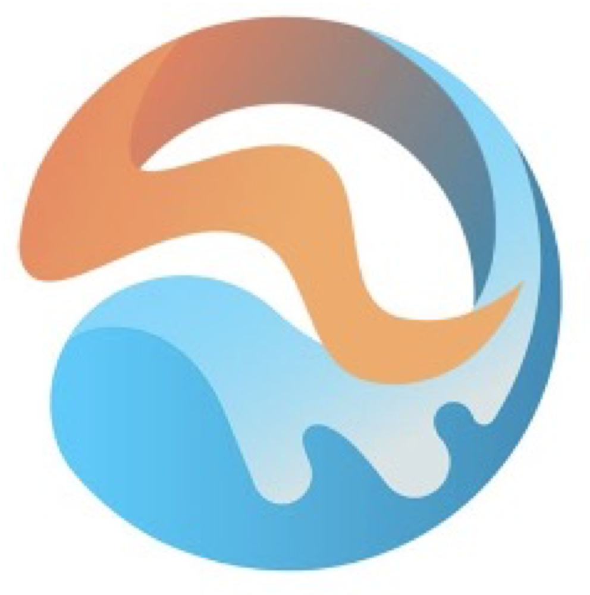
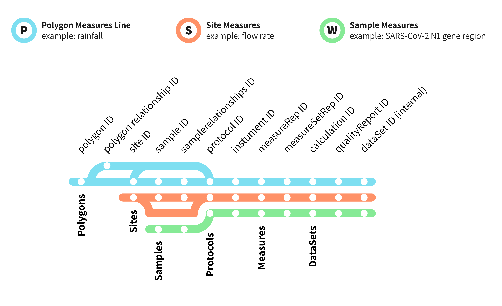
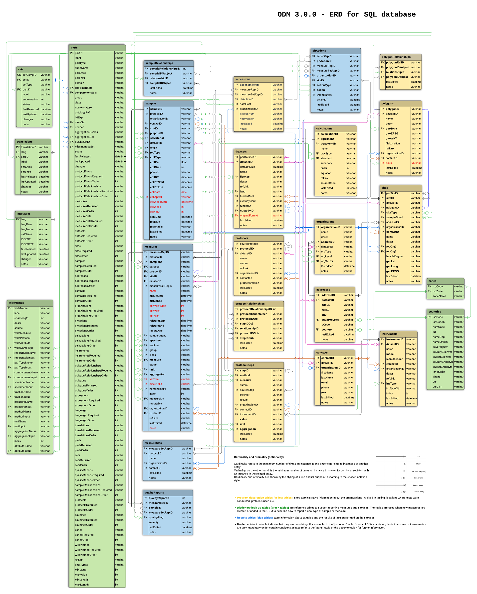

#  The Public Health Environmental Surveillance Open Data Model (PHES-ODM, or ODM)

<!-- badges: start -->

<!-- badges: end -->

## Description

PHES-ODM began as an open data model for wastwater-based surveillance of SARS-CoV-2. PHES-ODM Versions 2 & 3 expand the original ODM to include surface and air testing, in addition to water. These later versions allow for tracking of public health threats in any environment, and include robust support for reporting biologics, toxins, and/or other health risks.

The ODM strives to improve environmental and wastewater surveillance through interoperable data. The ODM follows an open science approach, including including [FAIR Guiding Principles](https://www.go-fair.org/fair-principles/). People and institutions can contribute to the development of the ODM and the ODM seeks to support a wide range of users. As part of that mission, the ODM team have developped a suite of tools to support use and uptake of the model. Repositories for the tools can be found here, and include a validator, a sharing tool, a mapping tool, and a pipeline to transform PCR outputs directly into ODM.

## Data and metadata dictionary

The ODM is comprised of 19 report tables and 7 look-up tables, linked to each other based on logic relationships. The following figure provides an overview of the different data sources that are currently captured.

The ODM is modular in its structure, and all tables are not mandatory. The structure is scalable as well to be only as complex as users need it to be, with much of the model existing optionally, but supporting all possible use-cases.

## Acknowledgements

Development and maintenance of the ODM is the result of a collaboration between researchers from multiple institutions:

- The University of Ottawa
- [CIHR Coronavirus Variants Rapid Response Network (CoVaRR-Net)](https://covarrnet.ca)
- Université Laval
- CHEO Research Institute
- modelEAU
- CentrEau - Centre québécois de recherche sur la gestion de l'eau
- Public Health Agency Canada
- Ministry of Environment, Conservation, and Parks - MECP Ontario
- European Union DG Joint Research Centre
- The Ottawa Hospital Research Institute
